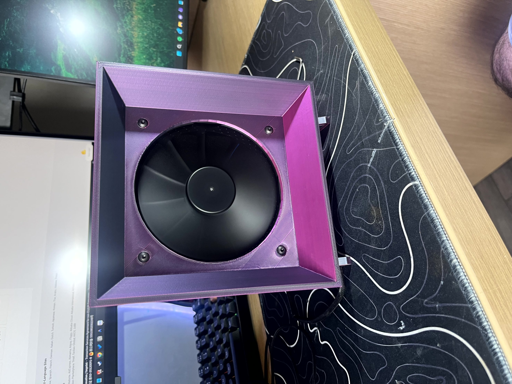
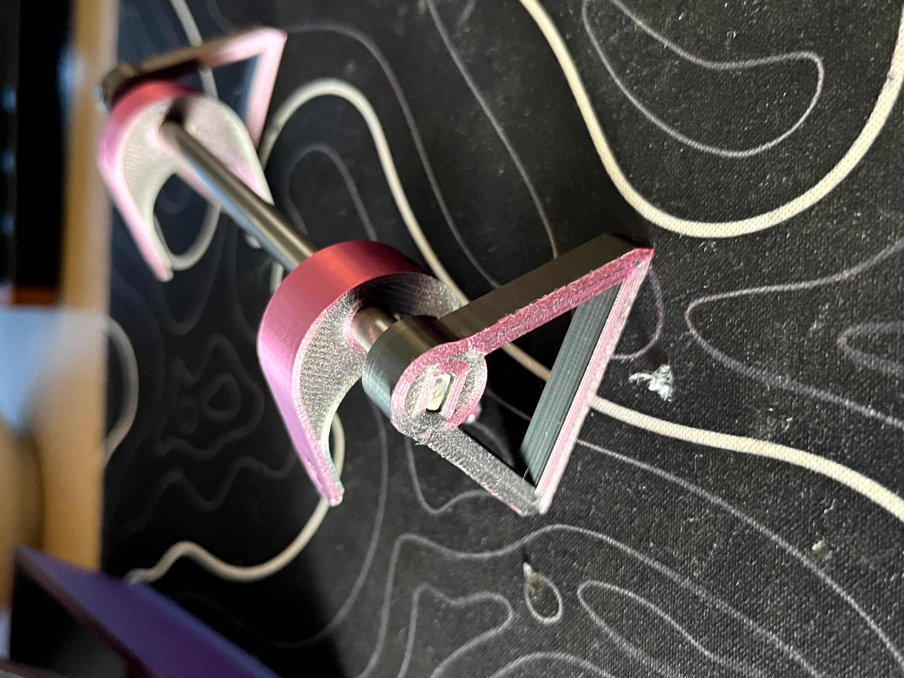
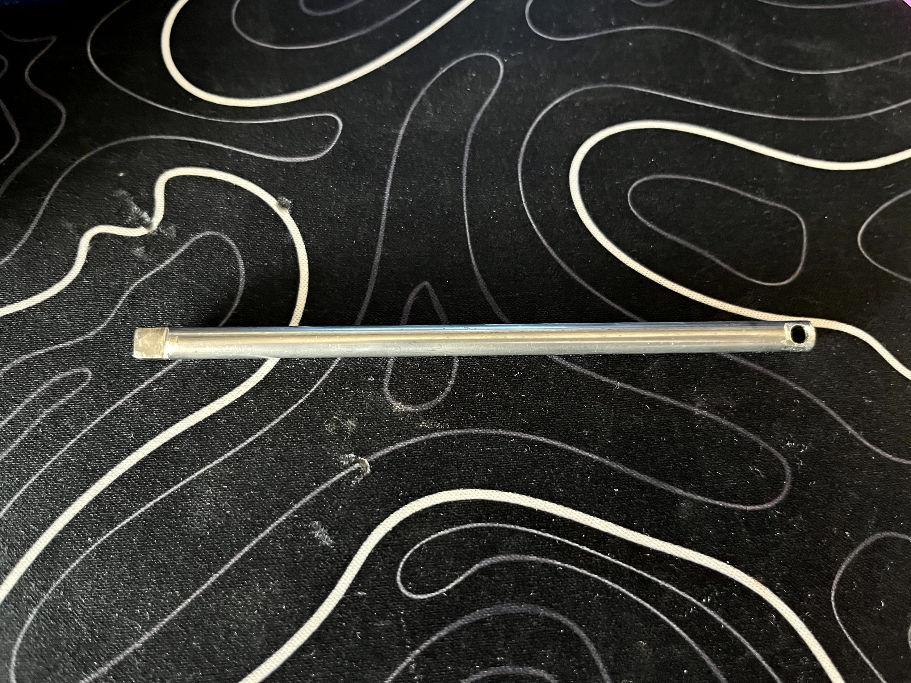
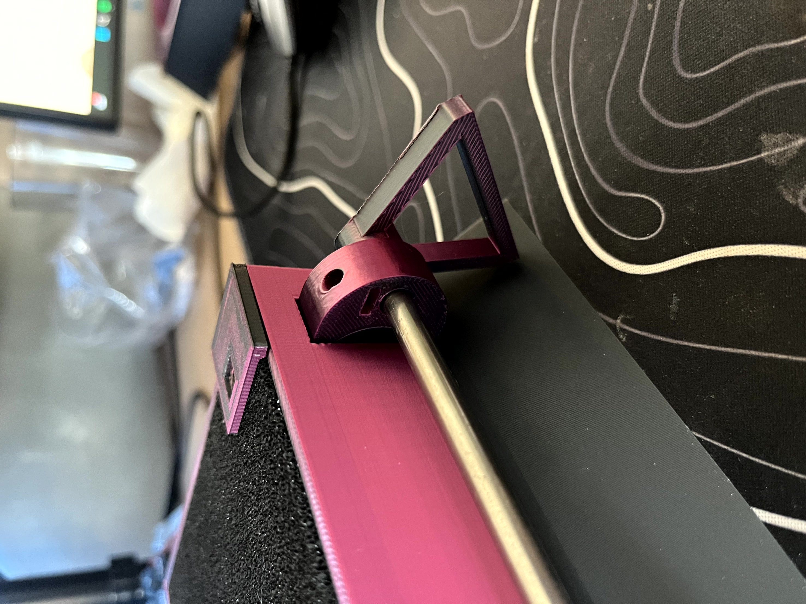

# DIY High-Performance Fume Extractor

A professional-grade, portable DIY fume extractor designed for electronics soldering and small-scale 3D printing. This project features a high-static-pressure PC fan, PWM speed control, and a rechargeable 18V tool battery integration for maximum portability and airflow.



## Features

- **High Airflow & Static Pressure**: Utilizes a 120mm industrial-grade PC fan for efficient smoke capture.
- **Portability**: Powered by a standard 18V TPCell (Li-ion) power tool battery.
- **Variable Speed Control**: Integrated PWM controller for precise airflow management and noise reduction.
- **Modular Filtering**: Easy-access filter slot for activated carbon and HEPA sheets.
- **Rugged 3D Printed Housing**: Designed for durability and stability on the workbench.

## Technical Specifications

| Parameter | Specification |
|-----------|---------------|
| Input Voltage | 18V DC (Standard Power Tool Battery) |
| Fan Size | 120mm x 120mm x 38mm |
| Control Type | PWM (Pulse Width Modulation) |
| Max Current Draw | ~1.5A - 2.0A |
| Filter Type | Activated Carbon / HEPA |

## Component List (BOM)

- **Fan**: 120mm 12V/24V Industrial High-Speed Fan (e.g., Delta or San Ace).
- **Power Source**: 18V TPCell Battery (or equivalent DeWalt/Milwaukee style with adapter).
- **Voltage Regulation**: DC-DC Buck Converter (Step-down to 12V if using a 12V fan).
- **Control**: PWM Motor Speed Controller with Potentiometer.
- **Switch**: Heavy-duty SPST rocker switch.
- **Connectors**: XT60 or 5.5mm DC Jack for modular power.

## Repository Structure

- `cad/`: 3D printable models (`.stl`, `.step`).
- `images/`: Project builds and assembly photos.
- `docs/`: Technical manuals and wiring diagrams.

## Assembly Gallery

````carousel

<!-- slide -->

<!-- slide -->

<!-- slide -->

````

---
*Developed for professional engineering portfolio.*
